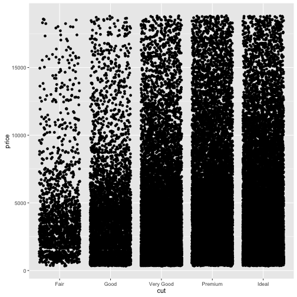
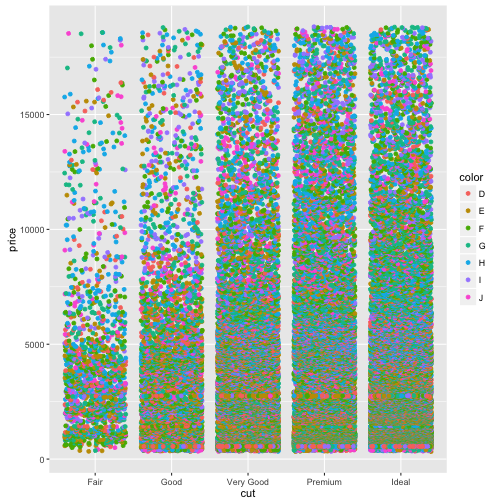

## Factors

In previous plots we've been using categories, specifically the `Species` category to split our data, colour our plots etc. These categorical columns are called Factors in R. Looking at the `diamonds` data set we can see how this is set up in R.

~~~
head(diamonds)
~~~
{: .r}

~~~
  carat       cut color clarity depth table price    x    y    z
1  0.23     Ideal     E     SI2  61.5    55   326 3.95 3.98 2.43
2  0.21   Premium     E     SI1  59.8    61   326 3.89 3.84 2.31
3  0.23      Good     E     VS1  56.9    65   327 4.05 4.07 2.31
4  0.29   Premium     I     VS2  62.4    58   334 4.20 4.23 2.63
5  0.31      Good     J     SI2  63.3    58   335 4.34 4.35 2.75
6  0.24 Very Good     J    VVS2  62.8    57   336 3.94 3.96 2.48
~~~
{: .output}

Here we can see the `cut`, `color` and `clarity` columns are all non-numeric, textual data. These are the factor variables of this dataset. We can confirm that by asking for the `class` of the column, that is, the type of data in it. We use the dataset `$` column name syntax for this.

~~~
class(diamonds$color)
~~~
{: .r}

~~~
[1] "ordered" "factor" 
~~~
{: .output}

~~~
class(diamonds$depth)
~~~
{: .r}

~~~
[1] "numeric"
~~~
{: .output}

We can also ask for all the different values of the factor, in R called the levels

~~~
levels(diamonds$color)
~~~
{: .r}

~~~
[1] "D" "E" "F" "G" "H" "I" "J"
~~~
{: .output}

~~~
levels(diamonds$cut)
~~~
{: .r}

~~~
[1] "Fair"      "Good"      "Very Good" "Premium"   "Ideal"    
~~~
{: .output}
## Colouring by factors

Let's look at applying mappings by a factor. Let's look at how price varies by cut.

~~~
p <- ggplot(diamonds) +  aes(cut,price) 
p + geom_jitter()
~~~
{: .r}

Now let's throw a second variable in there, lets see how color varies within each cut. We do this by creating a new aesthetic mapping within the geom_jitter()

~~~
p + geom_jitter(aes(colour=color))
~~~
{: .r}

The spots are all overlapping, we can force the different colours to stay separate with the `position` option. We use `position_dodge()` to make them dodge each other. The width option tells the spots how far to stay apart.

~~~
p + geom_jitter(aes(colour=color), position=position_dodge(width=0.5) )
~~~
{: .r}

We can also throw other geoms on top in the same way. EG Boxplots for each cut and colour

~~~
p + geom_jitter(aes(colour=color), position=position_dodge(width=0.5) ) + geom_boxplot( aes(colour=color), position=position_dodge() )
~~~
{: .r}

Remember layers/geoms are independent, so can be set up to show individual aspects of the data. Let's have a boxplot for the whole of the cut, irrespective of the colour.

~~~
p + geom_jitter(aes(colour=color),position=position_dodge(width=0.5)) + geom_boxplot() 
~~~
{: .r}

And of course, the whole thing still works even if we are comparing two numerical columns. We can still use the aesthetic mapping in the geom to colour our points by a factor

~~~
ggplot(diamonds) + aes(carat, price) + geom_point(aes(colour=cut))
~~~
{: .r}

## Small multiple plots
Sometimes, trying to squeeze a lot of data into one plot isn't the clearest way to show it. Instead small multiple plots (different data, same settings) can be used. In ggplot, this is called faceting and is done with the `facet_wrap()` or `facet_grid()` function. We use the factors to define the facet.  Let's add faceting to the previous plot

~~~
p <- ggplot(diamonds) + aes(carat, price) 
p + geom_point(aes(colour=cut)) + facet_wrap( ~ cut)
~~~
{: .r}

Here we see the plot is divided into panels, one for each 'cut'. The `facet_wrap()` function puts all the panels into a single row, but wll wrap that row as space demands. The syntax is a bit odd, we used the `~` operator to mean 'varies by' , even though we only used one variable. It's just a quirk of ggplot.

The `facet_grid()` function forces a grid structure and can take more than one factor. Now the `~` 'varies by' syntax makes more sense:

~~~
p + geom_point(aes(colour=cut)) + facet_grid(color ~ cut)
~~~
{: .r}

## Summary Statistics 
Factors are powerful things for helping us to quickly get summary statistics, and not just plots out of the data. We already saw how to generate summary statistics on a whole dataset using the `summary()` function. 

~~~
 summary(iris)
~~~
{: .r}

~~~
  Sepal.Length    Sepal.Width     Petal.Length    Petal.Width   
 Min.   :4.300   Min.   :2.000   Min.   :1.000   Min.   :0.100  
 1st Qu.:5.100   1st Qu.:2.800   1st Qu.:1.600   1st Qu.:0.300  
 Median :5.800   Median :3.000   Median :4.350   Median :1.300  
 Mean   :5.843   Mean   :3.057   Mean   :3.758   Mean   :1.199  
 3rd Qu.:6.400   3rd Qu.:3.300   3rd Qu.:5.100   3rd Qu.:1.800  
 Max.   :7.900   Max.   :4.400   Max.   :6.900   Max.   :2.500  
       Species  
 setosa    :50  
 versicolor:50  
 virginica :50  
                
                
                
~~~
{: .output}

But a better way to summarise by factor is with the `describeBy()` function in the `psych` package. Note you need to use `$` notation to describe the column with the factor you want to subset with. 

~~~
library(psych)
~~~
{: .r}

~~~

Attaching package: 'psych'
~~~
{: .output}

~~~
The following objects are masked from 'package:ggplot2':

    %+%, alpha
~~~
{: .output}

~~~
describeBy(iris, iris$Species)
~~~
{: .r}

~~~
$setosa
             vars  n mean   sd median trimmed  mad min max range skew
Sepal.Length    1 50 5.01 0.35    5.0    5.00 0.30 4.3 5.8   1.5 0.11
Sepal.Width     2 50 3.43 0.38    3.4    3.42 0.37 2.3 4.4   2.1 0.04
Petal.Length    3 50 1.46 0.17    1.5    1.46 0.15 1.0 1.9   0.9 0.10
Petal.Width     4 50 0.25 0.11    0.2    0.24 0.00 0.1 0.6   0.5 1.18
Species*        5 50 1.00 0.00    1.0    1.00 0.00 1.0 1.0   0.0  NaN
             kurtosis   se
Sepal.Length    -0.45 0.05
Sepal.Width      0.60 0.05
Petal.Length     0.65 0.02
Petal.Width      1.26 0.01
Species*          NaN 0.00

$versicolor
             vars  n mean   sd median trimmed  mad min max range  skew
Sepal.Length    1 50 5.94 0.52   5.90    5.94 0.52 4.9 7.0   2.1  0.10
Sepal.Width     2 50 2.77 0.31   2.80    2.78 0.30 2.0 3.4   1.4 -0.34
Petal.Length    3 50 4.26 0.47   4.35    4.29 0.52 3.0 5.1   2.1 -0.57
Petal.Width     4 50 1.33 0.20   1.30    1.32 0.22 1.0 1.8   0.8 -0.03
Species*        5 50 2.00 0.00   2.00    2.00 0.00 2.0 2.0   0.0   NaN
             kurtosis   se
Sepal.Length    -0.69 0.07
Sepal.Width     -0.55 0.04
Petal.Length    -0.19 0.07
Petal.Width     -0.59 0.03
Species*          NaN 0.00

$virginica
             vars  n mean   sd median trimmed  mad min max range  skew
Sepal.Length    1 50 6.59 0.64   6.50    6.57 0.59 4.9 7.9   3.0  0.11
Sepal.Width     2 50 2.97 0.32   3.00    2.96 0.30 2.2 3.8   1.6  0.34
Petal.Length    3 50 5.55 0.55   5.55    5.51 0.67 4.5 6.9   2.4  0.52
Petal.Width     4 50 2.03 0.27   2.00    2.03 0.30 1.4 2.5   1.1 -0.12
Species*        5 50 3.00 0.00   3.00    3.00 0.00 3.0 3.0   0.0   NaN
             kurtosis   se
Sepal.Length    -0.20 0.09
Sepal.Width      0.38 0.05
Petal.Length    -0.37 0.08
Petal.Width     -0.75 0.04
Species*          NaN 0.00

attr(,"call")
by.data.frame(data = x, INDICES = group, FUN = describe, type = type)
~~~
{: .output}
With this you can get a nice, comprehensive table of summary statistics across all the numerical columns, divided by the chosen factor.

For combinations of factors, you can use the `ddply()` function in the `plyr` package. Here you can choose a list of factors to summarise, but you must name the output columns and the R function to use. Helpfully the R function for a mean is `mean()` and the function for standard deviation is `sd()`.

Here, we divide up on `cut` and `colour` using the make-a-list function `c()`, we tell `ddply` we want to `summarise` and that it should add a `mean` column using the `mean()` function and an `sd` column using the `sd(function)`

~~~
library(plyr)
ddply(diamonds, c('cut', 'color'), summarise, mean=mean(price), sd=sd(price) )
~~~
{: .r}

~~~
         cut color     mean       sd
1       Fair     D 4291.061 3286.114
2       Fair     E 3682.312 2976.652
3       Fair     F 3827.003 3223.303
4       Fair     G 4239.255 3609.644
5       Fair     H 5135.683 3886.482
6       Fair     I 4685.446 3730.271
7       Fair     J 4975.655 4050.459
8       Good     D 3405.382 3175.149
9       Good     E 3423.644 3330.702
10      Good     F 3495.750 3202.411
11      Good     G 4123.482 3702.505
12      Good     H 4276.255 4020.660
13      Good     I 5078.533 4631.702
14      Good     J 4574.173 3707.791
15 Very Good     D 3470.467 3523.753
16 Very Good     E 3214.652 3408.024
17 Very Good     F 3778.820 3786.124
18 Very Good     G 3872.754 3861.375
19 Very Good     H 4535.390 4185.798
20 Very Good     I 5255.880 4687.105
21 Very Good     J 5103.513 4135.653
22   Premium     D 3631.293 3711.634
23   Premium     E 3538.914 3794.987
24   Premium     F 4324.890 4012.023
25   Premium     G 4500.742 4356.571
26   Premium     H 5216.707 4466.190
27   Premium     I 5946.181 5053.746
28   Premium     J 6294.592 4788.937
29     Ideal     D 2629.095 3001.070
30     Ideal     E 2597.550 2956.007
31     Ideal     F 3374.939 3766.635
32     Ideal     G 3720.706 4006.262
33     Ideal     H 3889.335 4013.375
34     Ideal     I 4451.970 4505.150
35     Ideal     J 4918.186 4476.207
~~~
{: .output}
> ## Quiz
> The built in dataset `CO2` describes measurement of CO2 uptake versus concentration for Quebec and Mississippi grasses in chilled and nonchilled tests. The dataset is as follows:
> * `Type` is a factor column with two levels `Quebec` and `Mississippi`
> * `Treatment` is a factor colum with two levels `nonchilled` and `chilled`
> * `Uptake` is a numerical colum with CO2 uptake rate in micromoles per metre squared per second
> * `Plant` is a factor with twelve levels, one for each individual plant assayed.
> 1. Create a plot with `geom_point()` that shows the Plant on the _x_-axis and the Uptake on the _y_-axis. Colour the points by 'Type' and `facet_wrap()` by `Treatment` to get a subplot for chilled and nonchilled.
{: .challenge}
