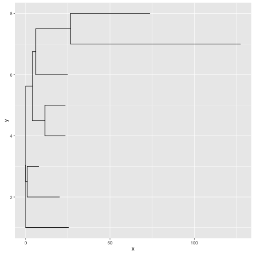
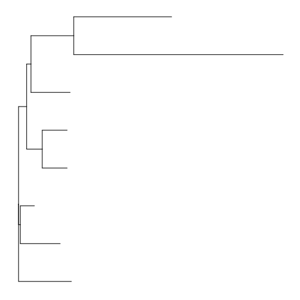
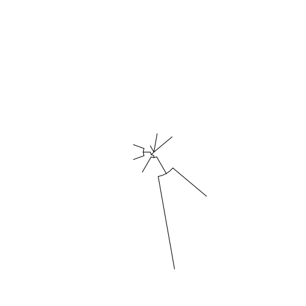
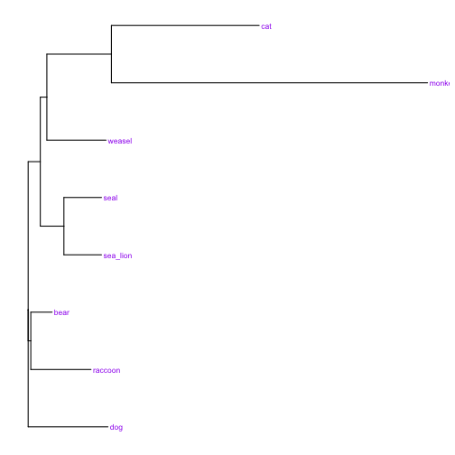
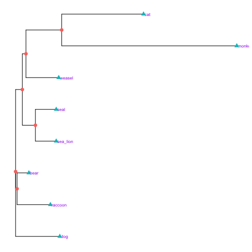
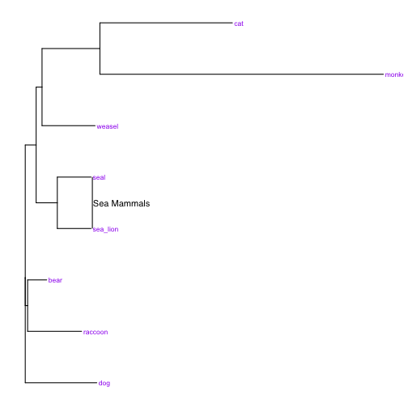
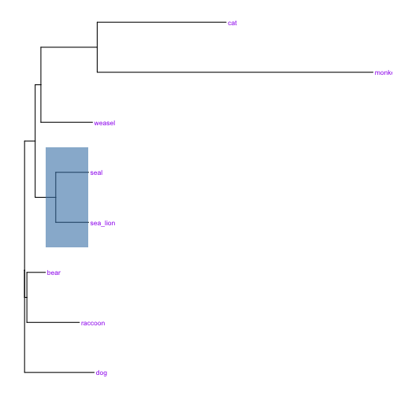
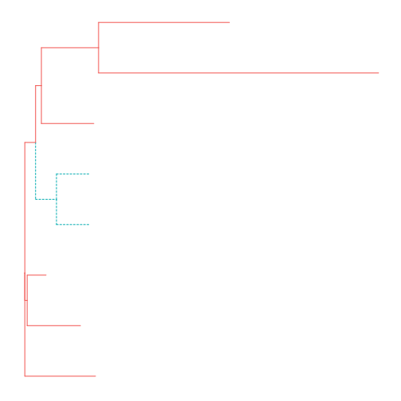
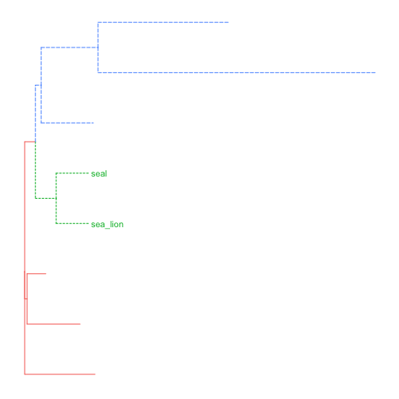
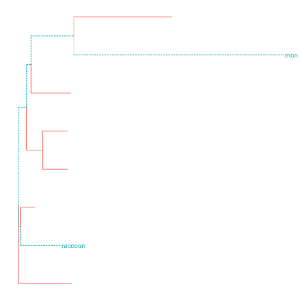

## `ggtree` - a Bioconductor package for displaying phylogenetic trees

Bioconductor is a (very) large set of libraries for operating on biological data types [https://www.bioconductor.org/](https://www.bioconductor.org/) . `ggtree` is a library inspired by `ggplot` for drawing trees.  Much of what we've already seen in `ggplot` is transferrable to `ggtree` so the syntax should be familiar.

> ## Installing `ggtree`
> Installing bioconductor takes a long time and isn't done in the same way as with other R packages. To install first  run this special script in the R console (making sure you have an internet connection) :
> `source("https://bioconductor.org/biocLite.R")` in the R console (making sure you have an internet connection). 
> Bioconductor libraries can then be installed with the `biocLite()` function 
> `biocLite("ggtree")
{: .callout }

`ggtree` takes a range of common tree formats as input. We'll use a sample file in `newick` format. This creates a special sort object called a 'phylo' object that knows all sorts of information about the tree.

~~~
library(ggtree)
~~~
{: .r}

~~~
If you use ggtree in published research, please cite:

Guangchuang Yu, David Smith, Huachen Zhu, Yi Guan, Tommy Tsan-Yuk Lam.
ggtree: an R package for visualization and annotation of phylogenetic trees with their covariates and other associated data.
Methods in Ecology and Evolution 2016, doi:10.1111/2041-210X.12628
~~~
{: .output}

~~~

Attaching package: 'ggtree'
~~~
{: .output}

~~~
The following object is masked from 'package:plyr':

    .
~~~
{: .output}

~~~
tree <- read.tree("data/mammals.nwk")
str(tree)
~~~
{: .r}

~~~
List of 4
 $ edge       : int [1:13, 1:2] 9 10 10 9 11 12 12 11 13 14 ...
 $ Nnode      : int 6
 $ tip.label  : chr [1:8] "raccoon" "bear" "sea_lion" "seal" ...
 $ edge.length: num [1:13] 0.846 19.2 6.8 3.874 7.53 ...
 - attr(*, "class")= chr "phylo"
 - attr(*, "order")= chr "cladewise"
~~~
{: .output}
The tree can be drawn using the `geom_tree()` function.

~~~
ggplot(tree) + geom_tree()
~~~
{: .r}

There is a special theme that sorts out the background for trees:

~~~
ggplot(tree) + geom_tree() + theme_tree()
~~~
{: .r}

And because you nearly always want these three `ggtree` provides a utility function to do all of that - `ggtree()`

~~~
ggtree(tree)
~~~
{: .r}

With this function we can add layout options

~~~
ggtree(tree, layout = "circular")
~~~
{: .r}

### Labels
Adding labels to treetips is done with the `geom_tiplab()` geom.

~~~
ggtree(tree) + geom_tiplab(size=3, color="purple")
~~~
{: .r}

Adding the nodes is done with special options to the `geom_point()` geom. The shape and colour aesthetics are set to the variable `isTip` which is an internal variable in the tree object.

~~~
p <-  ggtree(tree) + geom_tiplab(size=3, color="purple")
p + geom_point(aes(shape=isTip, color=isTip), size=3)
~~~
{: .r}

### Annotating and colouring clades
More useful is the ability to colour particular bits of the tree. First let's add a highlight bar to the side of the tree highlighting the sea mammal family. To do this we need to find the first node in the tree common to the clade we want to highlight. For this it's node number 12 and we use the `geom_cladelabel()` geom to add. We can use multiple `geom_cladelabel()` layers for more labels.

~~~
p + geom_cladelabel(node=12, label="Sea Mammals")
~~~
{: .r}

You can also use blocks of colour for this:

~~~
p + geom_hilight(node=12, fill="steelblue", alpha=.6)
~~~
{: .r}

To actually find the node number we need we can use the `MRCA()` function and pass it a list of labels we want the most recent common ancestor for

~~~
MRCA(tree, tip=c('seal','sea_lion'))
~~~
{: .r}

~~~
[1] 12
~~~
{: .output}

You can use this information to colour different parts of the tree, too. First you need to mark the tree objects as having a new `group` factor with the `groupClade()`, function and then dynamically colour by the new group factor

~~~
tree <- groupClade(tree, node=12)
ggtree(tree, aes(color=group, linetype=group))
~~~
{: .r}

And you can preferentially operate on a clade by using the geoms on particular group numbers, here adding a label only to group 1

~~~
tree <- groupClade(tree, node=c(12, 13) )
ggtree(tree, aes(color=group, linetype=group)) + geom_tiplab(aes(subset=(group==1)))
~~~
{: .r}

You can work on arbitrarily defined groups with the `groupOTU()` function

~~~
tree <- groupOTU(tree, focus=c("monkey", "raccoon"))
ggtree(tree, aes(color=group, linetype=group)) + geom_tiplab(aes(subset=(group==1)))
~~~
{: .r}

> ## Quiz
> 1. Set up an analysis folder:
>	1. Make a new folder called `analysis` on the Desktop
>	2. Inside `analysis` make a new folder called `raw` and put `pinf_mtDNA.newick` into it.
>	3. Start a new R Markdown document and save it in `analysis`
> 2. Create a circular cladogram of the tree and annotate the tips with tip labels. Rotate them to layout better. Hint: See the documentation [here](http://bioconductor.org/packages/release/bioc/html/ggtree.html)
> 3. Can you add the bootstrap values for each branchpoint? 
> 4. Find the most recent common ancestor of US5 and PE_6096. Highlight the clade with a coloured box.
{: .challenge}
