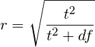

R is built for statistics so in this section we'll look at some common statistics functions. First just getting the summary or descriptive statistics. 

## Summary Statistics 

Earlier we saw that R has very many ways to get summary statistics like the mean and standard deviation from entire datasets. These ranged from the `summary()` function. 

~~~
 summary(iris)
~~~
{: .r}

~~~
  Sepal.Length    Sepal.Width     Petal.Length    Petal.Width   
 Min.   :4.300   Min.   :2.000   Min.   :1.000   Min.   :0.100  
 1st Qu.:5.100   1st Qu.:2.800   1st Qu.:1.600   1st Qu.:0.300  
 Median :5.800   Median :3.000   Median :4.350   Median :1.300  
 Mean   :5.843   Mean   :3.057   Mean   :3.758   Mean   :1.199  
 3rd Qu.:6.400   3rd Qu.:3.300   3rd Qu.:5.100   3rd Qu.:1.800  
 Max.   :7.900   Max.   :4.400   Max.   :6.900   Max.   :2.500  
       Species  
 setosa    :50  
 versicolor:50  
 virginica :50  
                
                
                
~~~
{: .output}

But a better way to summarise by factor is with the `describeBy()` function in the `psych` package. Note you need to use `$` notation to describe the column with the factor you want to subset with. 

~~~
library(psych)
describeBy(iris, iris$Species)
~~~
{: .r}

~~~
$setosa
             vars  n mean   sd median trimmed  mad min max range skew
Sepal.Length    1 50 5.01 0.35    5.0    5.00 0.30 4.3 5.8   1.5 0.11
Sepal.Width     2 50 3.43 0.38    3.4    3.42 0.37 2.3 4.4   2.1 0.04
Petal.Length    3 50 1.46 0.17    1.5    1.46 0.15 1.0 1.9   0.9 0.10
Petal.Width     4 50 0.25 0.11    0.2    0.24 0.00 0.1 0.6   0.5 1.18
Species*        5 50 1.00 0.00    1.0    1.00 0.00 1.0 1.0   0.0  NaN
             kurtosis   se
Sepal.Length    -0.45 0.05
Sepal.Width      0.60 0.05
Petal.Length     0.65 0.02
Petal.Width      1.26 0.01
Species*          NaN 0.00

$versicolor
             vars  n mean   sd median trimmed  mad min max range  skew
Sepal.Length    1 50 5.94 0.52   5.90    5.94 0.52 4.9 7.0   2.1  0.10
Sepal.Width     2 50 2.77 0.31   2.80    2.78 0.30 2.0 3.4   1.4 -0.34
Petal.Length    3 50 4.26 0.47   4.35    4.29 0.52 3.0 5.1   2.1 -0.57
Petal.Width     4 50 1.33 0.20   1.30    1.32 0.22 1.0 1.8   0.8 -0.03
Species*        5 50 2.00 0.00   2.00    2.00 0.00 2.0 2.0   0.0   NaN
             kurtosis   se
Sepal.Length    -0.69 0.07
Sepal.Width     -0.55 0.04
Petal.Length    -0.19 0.07
Petal.Width     -0.59 0.03
Species*          NaN 0.00

$virginica
             vars  n mean   sd median trimmed  mad min max range  skew
Sepal.Length    1 50 6.59 0.64   6.50    6.57 0.59 4.9 7.9   3.0  0.11
Sepal.Width     2 50 2.97 0.32   3.00    2.96 0.30 2.2 3.8   1.6  0.34
Petal.Length    3 50 5.55 0.55   5.55    5.51 0.67 4.5 6.9   2.4  0.52
Petal.Width     4 50 2.03 0.27   2.00    2.03 0.30 1.4 2.5   1.1 -0.12
Species*        5 50 3.00 0.00   3.00    3.00 0.00 3.0 3.0   0.0   NaN
             kurtosis   se
Sepal.Length    -0.20 0.09
Sepal.Width      0.38 0.05
Petal.Length    -0.37 0.08
Petal.Width     -0.75 0.04
Species*          NaN 0.00

attr(,"call")
by.data.frame(data = x, INDICES = group, FUN = describe, type = type)
~~~
{: .output}
With this you can get a nice, comprehensive table of summary statistics across all the numerical columns, divided by the chosen factor.

For combinations of factors, you can use the `ddply()` function in the `plyr` package. Here you can choose a list of factors to summarise, but you must name the output columns and the R function to use. Helpfully the R function for a mean is `mean()` and the function for standard deviation is `sd()`.

Here, we divide up on `cut` and `colour` using the make-a-list function `c()`, we tell `ddply` we want to `summarise` and that it should add a `mean` column using the `mean()` function and an `sd` column using the `sd(function)`

~~~
ddply(diamonds, c('cut', 'color'), summarise, mean=mean(price), sd=sd(price) )
~~~
{: .r}

~~~
         cut color     mean       sd
1       Fair     D 4291.061 3286.114
2       Fair     E 3682.312 2976.652
3       Fair     F 3827.003 3223.303
4       Fair     G 4239.255 3609.644
5       Fair     H 5135.683 3886.482
6       Fair     I 4685.446 3730.271
7       Fair     J 4975.655 4050.459
8       Good     D 3405.382 3175.149
9       Good     E 3423.644 3330.702
10      Good     F 3495.750 3202.411
11      Good     G 4123.482 3702.505
12      Good     H 4276.255 4020.660
13      Good     I 5078.533 4631.702
14      Good     J 4574.173 3707.791
15 Very Good     D 3470.467 3523.753
16 Very Good     E 3214.652 3408.024
17 Very Good     F 3778.820 3786.124
18 Very Good     G 3872.754 3861.375
19 Very Good     H 4535.390 4185.798
20 Very Good     I 5255.880 4687.105
21 Very Good     J 5103.513 4135.653
22   Premium     D 3631.293 3711.634
23   Premium     E 3538.914 3794.987
24   Premium     F 4324.890 4012.023
25   Premium     G 4500.742 4356.571
26   Premium     H 5216.707 4466.190
27   Premium     I 5946.181 5053.746
28   Premium     J 6294.592 4788.937
29     Ideal     D 2629.095 3001.070
30     Ideal     E 2597.550 2956.007
31     Ideal     F 3374.939 3766.635
32     Ideal     G 3720.706 4006.262
33     Ideal     H 3889.335 4013.375
34     Ideal     I 4451.970 4505.150
35     Ideal     J 4918.186 4476.207
~~~
{: .output}

> ## `mean()` and `sd()`
> R has even simpler functions for getting these values from lists of numbers, the `mean()` and `sd()` functions. These take lists of numbers, rather than whole datasets:
> `mean(c(1,2,3))`
>
> `[1] 2`
>
> or
> 
> `mean(iris$Sepal.Length)`
>
> `[1] 5.843333`
> 
> These are useful for quick calculations, but less so for real datasets since you have to apply manually to every subset that you are interested in.
{: .callout }

## The independent _t_ test

Let's look at the standard independent _t_ test. This is done with the `t.test()` function.  Let's look at the `iris` built in data set. 

The general form for a tidy dataset with factors like `iris` is `t.test(measured_thing ~ grouping_factor, data=dataset)`, so to compare Petal Widths between Species in the `iris` dataset

~~~
t.test(Petal.Width ~ Species, data = iris)
~~~
{: .r}

~~~
Error in t.test.formula(Petal.Width ~ Species, data = iris): grouping factor must have exactly 2 levels
~~~
{: .error}

Recall that this data set has 3 levels in the Species factor. The _t_ test, is built for one to one comparisons only, so we must have just two things to compare (and if you end up doing more than one _t_-test to compare lots of groups, you probably should be using ANOVA!). 

So lets use the `filter()` function from the `dplyr` package to select our two  

~~~
library(dplyr)
small_iris <- filter(iris, Species == c("versicolor", "setosa"))
t.test(Petal.Width ~ Species, data=small_iris)
~~~
{: .r}

~~~

	Welch Two Sample t-test

data:  Petal.Width by Species
t = -23.556, df = 41.092, p-value < 2.2e-16
alternative hypothesis: true difference in means is not equal to 0
95 percent confidence interval:
 -1.1812722 -0.9947278
sample estimates:
    mean in group setosa mean in group versicolor 
                   0.264                    1.352 
~~~
{: .output}

The output is fairly clear, the `p-value` is significant at some number less than 0.000000000000000022 (which is a built in lower limit that is caused by R running out of decimal places). 

The mean in each group is presented for each group, is the limits of the confidence interval of the range we would expect the true difference to fall between 95% of the time (this is not the CI of the mean of each data set!).

### Effect size for a _t_ test.
Even though the _p_ value is significant at the 95% level, we do not know whether it is a substantial difference. This is an important thing to assess too since small differences can be statistically significant simply by recording a difference many times (IE by having a large number of replicates), but small differences may not be meaningful in the real world. Effect size is one way of getting a measure of the size of the difference that is more meaningful and comparable between different experiments and answering whether the difference you've observed is substantive as well as significant. A responsible scientist will use both _p_ and effect size for deciding whether the difference between means has any real world meaning.

There are loads of effect sizes, we will look at two common ones for a _t_ test, Cohen's _d_ and Rosenthal's `r`.

#### Cohen's _d_
Cohen's _d_ is a standardized measure of effect and can be thought of the number of standard deviations between the means. Different _d_ mean different things:

<table>
	<tr><td>~0.2</td><td>small effect</td></tr>
	<tr><td>~0.5</td><td>medium effect</td></tr>
	<tr><td>~0.8</td><td>large effect</td></tr>
</table>

The _d_ can be calculated using the `cohen.d()` function in the `effsize` package and it works just like the `t.test()` function

~~~
library(effsize)
cohen.d(Petal.Width ~ Species, data=small_iris)
~~~
{: .r}

~~~
Error in cohen.d.default(d, f, ...): Factor should have only two levels
~~~
{: .error}

Doing this throws an error, because of an inconsistency between the programmers of the `t.test()` function, the `filter()` function and the `cohen.d()` function. Even though we filtered our `iris` dataset to just two levels, the `levels` attribute of the `small_iris` dataset still says there are 3 levels!

~~~
levels(small_iris$Species)
~~~
{: .r}

~~~
[1] "setosa"     "versicolor" "virginica" 
~~~
{: .output}

Which is annoying. The `t.test()` function just worked out the right number of levels, but the `cohen.d()` checks the `levels` attribute instead. This inconsistency is just a thing that happens when different people write different code. So to fix the levels after filtering we must manually set them

~~~
small_iris$Species <- factor(small_iris$Species, levels = c("setosa", "versicolor"))
cohen.d(Petal.Width ~ Species, data=small_iris)
~~~
{: .r}

~~~

Cohen's d

d estimate: -6.662612 (large)
95 percent confidence interval:
      inf       sup 
-8.173936 -5.151289 
~~~
{: .output}

And `cohen.d()` tells us this is a large difference, with _d_ = -6.663 (you can ignore the sign of the _d_).

#### Rosenthal's _r_
Another well used effect size is _r_. It is calculated with this formula, using _t_ and _df_ (degrees of freedom from the `t.test()`):

Different values of _r_ indicate different effect sizes, here's some rough rules.

<table>
	<tr><td>~0.1</td><td>small effect</td></tr>
	<tr><td>~0.3</td><td>medium effect</td></tr>
	<tr><td>~0.5</td><td>large effect</td></tr>
</table>

The values for _t_ and _df_ can be extracted from the result of `t.test()` and the value of `r` calculated. Let's specify a custom function to do this for us.

> ## Making a function
> Functions are the building blocks of R and it allows you to make your own. Its actually quite easy, its just a call to the `function()` and some regular R code surrounded by a couple of curly brackets - `{ }`. Here's how we'd define our own squaring function:
>
> `my_square <- function(x){ return(x * x) }`
>
> Now `my_square()` is a new function in R. We can use it like:
>
> `my_square(2)`
>
> `[1] 4`
>
> * The `x` is a temporary name for any data you want to use within the function. 
> * The `return()` keyword simply tells the function what to send you back here
> * To send data into the function you simply put it in the brackets after the function name.
> * The R code in the function can be as long as you want and split over many lines
{: .callout}

Here's a custom function for _r_,

~~~
rosenthal_r <- function(t_test_result){
	t <- t_test_result$statistic[[1]]
	df <- t_test_result$parameter[[1]]
	r <- sqrt(t^2/(t^2+df))
	return(r)
}
~~~
{: .r}
Here's how we use it:

~~~
my_t <- t.test(Petal.Width ~ Species, data=small_iris)
rosenthal_r(my_t)
~~~
{: .r}

~~~
[1] 0.9649093
~~~
{: .output}

Functions are useful because they are reuseable and save lots of typing.  The actual value of _r_ we get here is 0.96, which is considered a large effect.

## Linear regression
Linear regression (or as some think of it - correlation analysis) is at the base of a whole lot of statistics. In R it's done with the `lm()` function. `lm` stands for 'linear model' as the resulting formula gives us a line in the form `y=mx+c` that describes the relationship between our input data and can be used as a model to make predictions. Doing an `lm()` is similar to the `t.test()`.

~~~
lm(Petal.Width ~ Petal.Length, data=iris)
~~~
{: .r}

~~~

Call:
lm(formula = Petal.Width ~ Petal.Length, data = iris)

Coefficients:
 (Intercept)  Petal.Length  
     -0.3631        0.4158  
~~~
{: .output}

Which is the minimal information we need the first number (Intercept) -0.3631 is the `c` of `y=mx+c`, the place where the axis is crossed and the other (Petal.Length, 0.4158) is the gradient of the line. But we also want the _p_ and _R_ values, these are obtained by using the summary function on the result of `lm()`.

~~~
l <- lm(Petal.Width ~ Petal.Length, data=iris)
summary(l)
~~~
{: .r}

~~~

Call:
lm(formula = Petal.Width ~ Petal.Length, data = iris)

Residuals:
     Min       1Q   Median       3Q      Max 
-0.56515 -0.12358 -0.01898  0.13288  0.64272 

Coefficients:
              Estimate Std. Error t value Pr(>|t|)    
(Intercept)  -0.363076   0.039762  -9.131  4.7e-16 ***
Petal.Length  0.415755   0.009582  43.387  < 2e-16 ***
---
Signif. codes:  0 '***' 0.001 '**' 0.01 '*' 0.05 '.' 0.1 ' ' 1

Residual standard error: 0.2065 on 148 degrees of freedom
Multiple R-squared:  0.9271,	Adjusted R-squared:  0.9266 
F-statistic:  1882 on 1 and 148 DF,  p-value: < 2.2e-16
~~~
{: .output}

Where we can see that the _R_ is 0.9266 and _p_ is again < 2.2e-16. 

The `lm()` function works fine for a dataset with only one factor, in this example we've completely ignored the fact that the `Petal.Length` and `Petal.Width` are from 3 species. If we want to do the linear model species wise, we need to filter the data first 

~~~
ve <- filter(iris, Species == "versicolor")
lm(Petal.Width ~ Petal.Length, data=ve)
~~~
{: .r}

~~~

Call:
lm(formula = Petal.Width ~ Petal.Length, data = ve)

Coefficients:
 (Intercept)  Petal.Length  
    -0.08429       0.33105  
~~~
{: .output}

## One Way ANOVA
The ANOVA is actually based on a linear model so we need to construct that first, again with the `lm()` function. This time we use the factor we want to use to split the data up as the second variable. We do the actual ANOVA with `aov()` function and get the answers with the `summary.lm()` function on that.

~~~
l <- lm(Petal.Width ~ Species, data = iris)
a <- aov(l)
summary.lm(a)
~~~
{: .r}

~~~

Call:
aov(formula = l)

Residuals:
   Min     1Q Median     3Q    Max 
-0.626 -0.126 -0.026  0.154  0.474 

Coefficients:
                  Estimate Std. Error t value Pr(>|t|)    
(Intercept)        0.24600    0.02894    8.50 1.96e-14 ***
Speciesversicolor  1.08000    0.04093   26.39  < 2e-16 ***
Speciesvirginica   1.78000    0.04093   43.49  < 2e-16 ***
---
Signif. codes:  0 '***' 0.001 '**' 0.01 '*' 0.05 '.' 0.1 ' ' 1

Residual standard error: 0.2047 on 147 degrees of freedom
Multiple R-squared:  0.9289,	Adjusted R-squared:  0.9279 
F-statistic:   960 on 2 and 147 DF,  p-value: < 2.2e-16
~~~
{: .output}

Then we can apply Tukey's HSD to get the actual _p_-values between groups.

~~~
TukeyHSD(a)
~~~
{: .r}

~~~
  Tukey multiple comparisons of means
    95% family-wise confidence level

Fit: aov(formula = l)

$Species
                     diff       lwr       upr p adj
versicolor-setosa    1.08 0.9830903 1.1769097     0
virginica-setosa     1.78 1.6830903 1.8769097     0
virginica-versicolor 0.70 0.6030903 0.7969097     0
~~~
{: .output}

where the column `diff` gives us the difference between means, the `lwr` and `upr` bounds are the confidence interval and `p adj` is the _p_ value rounded off. Here Petal Widths are significantly different between the species. 

> ## Quiz
> 1. Using the `mtcars` dataset, work out whether the number of cylinders (cyl) in a car has an effect on the mpg (miles per gallon), specifically answer whether any difference is statistically significant and substantial.
> Hints: Remember to use the `str()` function to check factors are factors. A one-way ANOVA should be appropriate for this sort of data. The `F` statistic or ratio is a good estimate of effect size.
> Extra Credit: Do any of the warnings about 'unbalanced' design make you worry about the results of the test?
{: .challenge}
